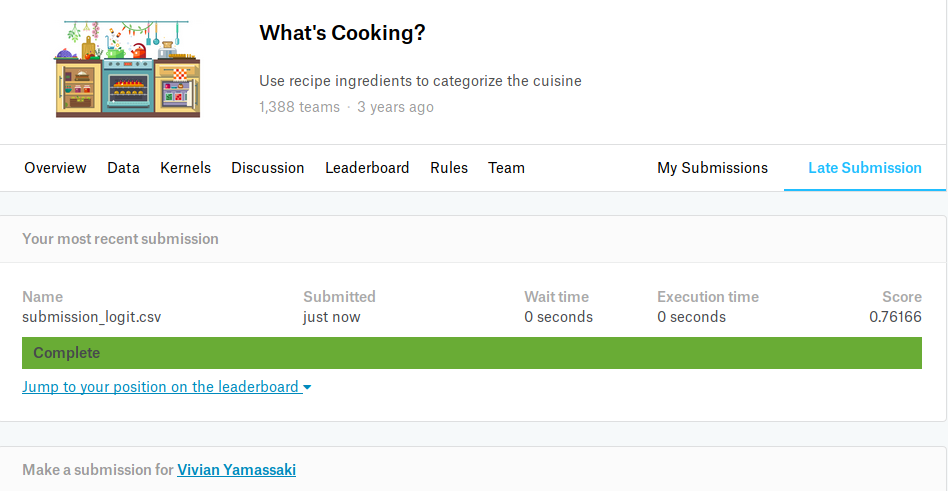

# Nanodegree Engenheiro de Machine Learning
## Projeto final
Vivian Mayumi Yamassaki Pereira  
19 de abril de 2019

## I. Definição

### Visão geral do projeto

No projeto final foi desenvolvido um modelo para resolver um problema de classificação, no qual, a partir de uma lista de ingredientes de uma receita, deve-se predizer o tipo de cozinha da qual a receita pertence. Por exemplo, a partir de uma lista de ingredientes composta por leite condensado, cacau em pó, manteiga e chocolate granulado, o modelo deve predizer que o tipo de cozinha é brasileira, visto que se trata da receita de um brigadeiro.

Para resolver o problema de classificação do tipo de cozinha, são utilizados os ingredientes que compõem a receita. Como esses ingredientes se tratam de dados textuais, foi necessário realizar a análise e o processamento do texto para que o modelo pudesse entender os dados e realizar as predições.

Esse problema foi retirado de uma competição existente no [Kaggle](https://www.kaggle.com/c/whats-cooking). Os conjuntos de dados utilizados neste projeto podem ser encontrados na página da competição.

### Descrição do problema

O problema resolvido é, a partir de uma lista de ingredientes fornecida, predizer de qual tipo de cozinha (brasileira, japonesa, italiana, etc.) é a receita elaborado com tais ingredientes. Como o tipo de culinária descreve uma categoria para a qual a receita pertence, esse problema trata-se de um problema de classificação e, como são muitos tipos de cozinhas, é um problema de classificação multiclasse.

Esse problema, denominado  _What's cooking?_  é um desafio existente no Kaggle, plataforma com diversos conjuntos de dados e desafios para profissionais e entusiastas em machine learning. Ele possui uma particularidade de possuir duas versões do desafio no Kaggle, ambas com o mesmo conjunto de dados. A única diferença entre essas duas versões é a submissão. A  [primeira versão do desafio](https://www.kaggle.com/c/whats-cooking)  foi publicado há 3 anos atrás e a submissão é um arquivo contendo as predições do conjunto de teste fornecido. Já a  [segunda versão do desafio](https://www.kaggle.com/c/whats-cooking-kernels-only), publicada 6 meses atrás, só aceita submissões dos scripts utilizados para criar os modelos e as predições.

As predições dos modelos criados neste projeto foram submetidos para a primeira versão do desafio para que suas acurácias fossem calculadas. Entretanto, como nessa versão os primeiros colocados no ranking não forneceram o tipo de algoritmo utilizado, foi considerado como benchmark o modelo com a melhor acurácia fornecido na segunda versão do desafio.

As tarefas realizadas inicialmente para a resolução do problema foram as seguintes:
* Download e leitura dos conjuntos de treino e teste, que estão em formato JSON
* Realização de uma análise e visualização exploratória dos dados de treinamento
* Pré-processamento dos dados de treinamento e teste
* Treinamento dos modelos escolhidos (foram escolhidos três modelos que resolvem problemas de classificação)
* Submissão das predições para o conjunto de teste para o [Kaggle](https://www.kaggle.com/c/whats-cooking) para obter a acurácia do modelo para o dados de teste
* Comparação das acurácias obtidas pelos modelos escolhidos e comparação com o benchmark

Após a realização dessas tarefas iniciais, foram realizadas mais algumas tarefas com base nos resultados obtidos pelas submissões das predições dos modelos. 
Isso foi necessário porque o conjunto de teste fornecido no Kaggle não possui as classes dos exemplos de teste. Só é possível verificar o desempenho do modelo para o conjunto de teste realizando a submissão das predições na página da competição no site, que só retorna a acurácia obtida pelo modelo, mas não as classes corretas. Deste modo, não seria possível realizar uma análise mais profunda sobre os modelos para identificar o que eles estavam errando. As tarefas realizadas posteriormente foram:
* Escolha do modelo que obteve a maior acurácia dentre as submissões feitas para o Kaggle
* Separação do conjunto de treino de modo que 70% continue a fazer parte do conjunto de treinamento e os 30% restantes se tornem um novo conjunto de teste
* Treinamento do modelo com o conjunto de treino reduzido
* Predição das classes para o novo conjunto de teste (gerado a partir do conjunto de treino)
* Avaliação das predições para o novo conjunto de teste

Ao final desses dois conjuntos de tarefas, foi possível verificar se os modelos desenvolvidos neste projeto foram melhores para resolver o problema do que o benchmark e também verificar quais eram os maiores acertos e erros do modelo retreinado.

### Métricas

O ranking do Kaggle para este problema é dado pela acurácia; portanto, esta foi a métrica de avaliação utilizada para comparar os resultados dos três modelos iniciais com o benchmark. A acurácia é dada pela proporção de exemplos que foram corretamente preditos pelo modelo.

Como o desafio do Kaggle não fornece a variável resposta do conjunto de teste, não é possível realizar outras métricas de avaliação com ele, visto que o retorno da plataforma contém apenas a acurácia do modelo calculada para classificá-lo com relação aos demais. 

Por esse motivo, para que fosse possível fazer mais um tipo de avaliação, o modelo com a melhor acurácia obtida nesse projeto foi treinado novamente dessa vez somente com uma porção do conjunto de treinamento e a porção restante do treinamento foi utilizada como teste (já que era o único meio de se obter a classe). Para esse novo modelo, também foi calculada a acurácia (para verificar se diminuiu ou aumentou com o retreino) e também foi gerada uma matriz de confusão para verificar quais tipos de cozinha o modelo mais acertou e errou, assim como para identificar em quais tipos de cozinha o modelo se confundiu.

## II. Análise

### Exploração dos dados

Os dados do desafio _What's cooking?_ foram obtidos [aqui](https://www.kaggle.com/c/whats-cooking/data). O problema possui dois conjuntos de dados: um de treino e outro de teste. O conjunto de treinamento contém 39.774 exemplos e possui 3 variáveis: 
-   **cuisine**: tipo de culinária da qual a receita pertence. Essa é a variável resposta (a classe que o modelo a ser criado deve prever)
-   **id**: número identificador único da receita
-   **ingredients**: lista de ingredientes que compõem a receita

Segue abaixo 5 exemplos presentes no conjunto de treino que apresentam essas variáveis:

Já o conjunto de teste contém 9.944 exemplos e apenas 2 colunas: 
-   **id**: número identificador único da receita
-   **ingredients**: lista de ingredientes que compõem a receita

No caso do conjunto de teste, foi removido a coluna **cuisine**, pois ela é a variável resposta. Segue abaixo 5 exemplos presentes no conjunto de teste:

A classe, que é dada pelo tipo de cozinha, pode ser descrita por múltiplos valores; logo, trata-se de um problema multiclasse. O conjunto possui 20 diferentes tipos de cozinha, que estão descritos na tabela abaixo. A tabela contém uma coluna contando o número da cozinha (apenas para facilitar a contagem das 20 cozinhas); a bandeira do país de origem do tipo de cozinha; o nome da cozinha presente no conjunto de dados; esse nome de cozinha traduzido para o português; e também foram adicionadas mais duas colunas contendo a quantidade de receitas da respectiva cozinha que está presente no conjunto de dados e sua proporção com relação a todas as receitas presentes no conjunto de dados:
|#|bandeira|nome no dataset| nome traduzido| quantidade de ingredientes| proporção do conjunto de dados|
|--|--|---|--|---|--|
|1||brazilian|brasileira|467|1.17%|
|2||british|britânica|804|2.02%|
|3||cajun_creole| cajun/crioula|1546|3.88|
|4||chinese| chinesa|2673|6.72%|
|5||filipino| filipina|755|1.89%|
|6||french| francesa|2646|6.65%|
|7||greek| grega|1175|2.95%|
|8||indian| indiana|3003|7.55%|
|9||irish| irlandesa|667|1.67%|
|10||italian| italiana|7838|19.70%|
|11||jamaican| jamaicana|526|1.32%|
|12||japanese| japonesa|1423|3.57%|
|13||korean| coreana|830|2.08%|
|14||mexican| mexicana|6438|16.18%|
|15||moroccan| marroquina|821|2.06%|
|16||russian| russa|489|1.22%|
|17||southern_us|sulista (do sul dos Estados Unidos)|4320|10.86%|
|18||spanish| espanhola|989|2.48%|
|19||thai| tailandesa|1539|3.86%|
|20||vietnamese| vietnamita|825|2.07%|

Por meio das informações e do gráfico acima, é possível notar que a cozinha com mais receitas presentes no conjunto de dados é a italiana, enquanto que a cozinha com menos receitas é a brasileira, que representam, respectivamente, 19.7% e 1.17% do conjunto de dados. Somente as três cozinhas com mais receitas (italiana, mexicana e sulista) já contemplam quase metade de todas as receitas do conjunto de treinamento (46.75%).

Durante a análise exploratória dos dados, foi possível notar que não existiam valores faltantes, nem no conjunto de treino e nem no conjunto de teste, para nenhuma das colunas dos conjuntos.

No entanto, a análise dos ingredientes presentes nas receitas permitiu observar valores atípicos. A tabela abaixo apresenta a mediana e as quantidades mínimas e máximas de ingredientes que foram encontradas no conjunto de treinamento:

||Quantidade de ingredientes|
|---------|----------|
|Mínimo| 1|
|Máximo| 65|
|Mediana|10|

A análise desses casos extremos permitiu notar que se tratavam de erros no conjunto de dados. Portanto, foi necessário fazer a remoção desses outliers, visto que não se tratavam de receitas que realmente existiam.

Além disso, a análise da lista de ingredientes permitiu notar os seguintes pontos:
-  Existiam receitas repetidas para uma mesma cozinha (visto que possuíam a mesma lista de ingredientes)
-  Existiam ingredientes repetidos na lista de ingredientes de algumas receitas
-  Existiam alguns problemas com os nomes dos ingredientes 
    -  Mesmos ingredientes escritos às vezes com letra maiúscula e outras com letra minúscula
    -  Nomes com caracteres numéricos e especiais
    -  Nomes contendo palavras indicando unidades de medida
    -  Nomes contendo [stopwords]([https://en.wikipedia.org/wiki/Stop_words](https://en.wikipedia.org/wiki/Stop_words))
    - Mesmos ingredientes escritos às vezes no plural e outras no singular

Todos os pontos citados acima foram tratados durante o pré-processamento dos dados.

### Visualização exploratória

A visualização exploratória escolhida foi o gráfico abaixo:

Esse gráfico contém a lista dos 15 ingredientes mais utilizados dentre todas as receitas presentes no conjunto de dados. O eixo X contém os ingredientes mais utilizados e o eixo Y contém a quantidade de receitas do conjunto de treinamento que utilizam esse ingrediente.

Ele permite notar, por exemplo que, por aparecer em tantas receitas, é possível que o sal não tenha um poder de predição tão alto, visto que não deve ser característico de um determinado tipo de cozinha. O mesmo deve ocorrer para os outros ingredientes muito frequentes em diversos tipos de cozinha. 

Além disso, comparando com os outros gráficos dos ingredientes mais utilizados por tipo de cozinha (que estão no notebook contendo a análise exploratória), foi possível notar que as cozinhas asiáticas, diferente das demais, possuem outros ingredientes mais utilizados ao invés do sal, como o molho de soja (nas cozinhas japonesa, chinesa e coreana) e o molho de peixe (nas cozinhas vietnamita e tailandesa) e, portanto, esses ingredientes podem ser considerados importantes para o modelo visto que podem diferenciar essas cozinhas das demais.

### Algoritmos e técnicas

Inicialmente, foram escolhidos os três modelos abaixo para resolver o problema de classificação descrito neste projeto:
 
* **Modelo A - Regressão Logística**
	* A [regressão logística](https://scikit-learn.org/stable/modules/generated/sklearn.linear_model.LogisticRegression.html) foi escolhida porque é um modelo bem simples de ser implementado, geralmente é eficiente e, por esses motivos, é muito utilizado como benchmark quando não se possui nenhum modelo de referência.
* **Modelo B - Random Forest**
	* A [Random Forest](https://scikit-learn.org/stable/modules/generated/sklearn.ensemble.RandomForestClassifier.html) foi escolhida porque geralmente apresenta bons resultados para diversos problemas. Por ser um método de ensemble, a combinação de diversas árvores de decisão geralmente obtém resultados melhores do que quando utilizada somente uma árvore.
* **Modelo C - SVM**
	* A [SVM](https://scikit-learn.org/stable/modules/generated/sklearn.svm.SVC.html#sklearn.svm.SVC) também foi escolhida porque foi o modelo utilizado pelo primeiro colocado no ranking do Kaggle para este problema, visto que obteve a maior acurácia.

Inicialmente, os modelos foram rodados com seus parâmetros padrões do scikit-learn. O valor padrão de cada parâmetro pode ser encontrado nos links referentes a cada um dos modelos.

### Benchmark

Quando este documento foi criado, o modelo com melhor acurácia postado na [página de scripts](https://www.kaggle.com/c/whats-cooking-kernels-only/kernels) do desafio possuía uma acurácia de 0.82803, que foi criado utilizando uma SVM e cujo script encontra-se [aqui](https://www.kaggle.com/oracool/natty-svc-better-score-than-the-first-place). Portanto, esse modelo e seu resultado que foram utilizados como benchmark para realizar a comparação com os três modelos iniciais.

## III. Metodologia

### Pré-processamento de dados

Com base nas observações realizadas durante a fase de análise exploratória dos dados, os seguintes tratamentos foram realizados nos dois conjuntos de dados (de treinamento e teste):

-   Conversão de todas as palavras para letras minúsculas
-   Remoção de caracteres numéricos e especiais
-   Remoção de palavras indicando unidades de medida
-   Remoção de stopwords
-   [Lematização](https://en.wikipedia.org/wiki/Lemmatisation) das palavras (para transformar palavras no plural para o singular)
-   Exclusão de ingredientes repetidos na lista de ingredientes de algumas receitas

Além disso, os dois tratamentos abaixo foram realizados somente no conjunto de treinamento, visto que o conjunto de teste não possui a classe, que permitiria identificar as receitas repetidas, e porque não podem ser removidos os outliers, visto que o arquivo a ser fornecido para o Kaggle deve conter as predições para todos os exemplos existentes no conjunto de teste:
-   Exclusão das receitas repetidas por tipo de cozinha
-   Exclusão de outliers (receitas com apenas 1 ingrediente ou com mais de 40)

Também foram construídas duas novas variáveis a partir da lista de ingredientes:
-   `ingredients_qtt`: indica a quantidade de ingredientes presentes na receita. Essa variável foi criada porque  durante a análise exploratória foi identificado que a quantidade de ingredientes por tipo de cozinha podia variar e, portanto, essa variável poderia fornecer algum poder de predição ao modelo
-   `ingredients_text`: lista de ingredientes presentes na receita. Ao invés de ser uma lista de strings, é somente uma string na qual os ingredientes estão separados por vírgula. Essa variável foi criada somente para facilitar a conversão do texto para um dado numérico que permitisse que o modelo fosse treinado; ela não será utilizada nos conjuntos de dados finais.

Além disso, como o conjunto de dados é composto por dados textuais, foi necessário realizar transformações no conjunto antes de realizar o treinamento dos três modelos descritos acima. Para tanto, foi utilizado o [TF-IDF Vectorizer](https://scikit-learn.org/stable/modules/generated/sklearn.feature_extraction.text.TfidfVectorizer.html) que cria uma matriz de [TF-IDF](https://en.wikipedia.org/wiki/Tf%E2%80%93idf), a qual indica importância de cada ingrediente para a receita dada todas as receitas existentes no conjunto de dados.

Como a regressão logística e a SVM com kernel RBF apresentam melhores resultados quando as variáveis estão em escalas similares, foi necessário aplicar o [StandardScaler](https://scikit-learn.org/stable/modules/generated/sklearn.preprocessing.StandardScaler.html) nos conjuntos de dados, visto que a matriz de TF-IDF está numa escala diferente da quantidade de ingredientes. A Random Forest não necessita desse tratamento, mas foi realizado o treinamento tanto sem a aplicação do StandardScaler quanto com para verificar se um deles poderia obter um resultado melhor.

Por fim,  além da transformação da lista de ingredientes, também foi necessário converter a classe, visto que o tipo de cozinha é um dado textual. Tal conversão foi feita utilizando o [LabelEncoder](https://scikit-learn.org/stable/modules/generated/sklearn.preprocessing.LabelEncoder.html), que modo que cada tipo de cozinha passou a ser representado por um número (a brasileira por 0, a britânica por 1, etc.).

Ao final da etapa de pré-processamento de dados, foi obtido um conjunto de treinamento com 39677 exemplos e 2731 variáveis e um conjunto de teste com 9944 exemplos e 2731 variáveis. As 2731 variáveis correspondem a matriz TF-IDF concatenada com a variável de quantidade de ingredientes.

### Implementação

Após a fase de pré-processamento, foram criados três notebooks contendo o treinamento de cada modelo:

* **Modelo A - Regressão Logística**
	* O treinamento da Regressão Logística encontra-se no notebook **_logistic_regression.ipynb_**
* **Modelo B - Random Forest**
	* O treinamento da Random Forest encontra-se no notebook **_random_forest.ipynb_**
* **Modelo C - SVM**
	* O treinamento da SVM encontra-se no notebook **_svm.ipynb_**

Todos os modelos foram construídos utilizando a biblioteca [scikit-learn](https://scikit-learn.org/stable/). Como já foi dito anteriormente,  esses três modelos iniciais foram construídos com os parâmetros _default_ dos algoritmos presentes no scikit-learn.

Além disso, para todos eles, foi utilizado o [OneVsRestClassifier](https://scikit-learn.org/stable/modules/generated/sklearn.multiclass.OneVsRestClassifier.html), que é uma estratégia muito utilizada para problemas de classificação multiclasse, que é o caso do conjunto de dados presente neste projeto. Essa estratégia consiste em treinar um classificador por classe (uma classe contra as outras), com a vantagem de ser computacionalmente eficiente e fornecer maior interpretabilidade.

Por fim, é importante salientar que, inicialmente, havia sido planejado aplicar o GridSearch para todos os três modelos, de modo a se testar diversos parâmetros e tentar encontrar um modelo com acurácia acima do benchmark. Infelizmente, esses outros experimentos não foram realizados por questões de complexidade e tempo (a máquina na qual os modelos foram treinados não possuía tanta capacidade computacional para realizar os testes rapidamente); por este motivo, o GridSearch só foi aplicado no modelo cujas predições resultaram na maior acurácia após a submissão ao Kaggle. 

### Refinamento

Por questões de questões de complexidade e tempo, apenas no modelo que obteve a melhor acurácia dentre os três modelos iniciais foi utilizado o [GridSearch](https://scikit-learn.org/stable/modules/generated/sklearn.model_selection.GridSearchCV.html) para testar diferentes combinações de parâmetros, de modo que se tentasse obter um melhor resultado do que o que seria obtido somente com os parâmetros padrões do algoritmo. 

No caso do GridSearch, a medida para escolher o melhor modelo foi o [F1-weighted](https://scikit-learn.org/stable/modules/generated/sklearn.metrics.f1_score.html), visto que como o conjunto de dados é desbalanceado (há muito mais exemplos da cozinha italiana do que a brasileira, por exemplo), só a acurácia pode não ser uma medida muito adequada. O F1-score é mais adequado porque leva em consideração tanto a precisão (proporção de exemplos classificados como pertencentes a uma cozinha que realmente eram dessa cozinha) quanto o recall (proporção de exemplos de uma cozinha que foram corretamente classificados como sendo dessa cozinha) e, no caso de um problema multiclasse, o F1-weighted calcula a métrica para cada classe.

O modelo que obteve a maior acurácia foi a regressão logística e, para ela, foi utilizado o GridSearch para treinar o modelo com uma proporção do conjunto de treino e testar com a proporção restante. Os seguintes parâmetros foram testados:

|Parâmetro| Valores testados|
|---------|---|
|**Solver**| saga e lbfgs|
| **C**|0.1, 1 e 10|
|**Penalty** (regularização)|L1 (testado somente quando o solver é saga) e L2|

Com todas essas combinações, foram realizados 27 treinamentos (são as 9 combinações de parâmetros acima multiplicadas por 3, que é a quantidade de k do k-fold cross-validation que o GridSearch faz para cada combinação) e o GridSearch retornou o modelo com maior F1-weighted.

## IV. Resultados

### Modelo de avaliação e validação

Com os três modelo treinados, foram realizadas as predições para o conjunto de teste. Essas predições foram submetidas ao Kaggle e as seguintes acurácias foram retornadas para cada modelo:

* **Modelo A - Regressão Logística**
	
* **Modelo B - Random Forest**
	
* **Modelo C - SVM**
	

Como é possível notar nas figuras acima, o modelo com a maior acurácia foi a regressão logística, que obteve uma acurácia de 0.76166.

Esse modelo foi treinado novamente dessa vez com o conjunto de treinamento dividido entre treino e teste (visto que era o único modo de se obter as classes) e com o GridSearch para encontrar uma melhor combinação de parâmetros para esse novo conjunto de dados.

Para esse novo treinamento, o melhor modelo foi a regressão logística com os parâmetros solver _SAGA_, C de 0.1 e penalty L1. Ele obteve uma acurácia de 0.7788138440860215 e os outros seguintes resultados:

Os resultados acima indicam que o modelo foi melhor para classificar alguns tipos de cozinhas do que outras. Por exemplo, para a cozinha mexicana, o modelo apresentou uma precisão, recall e um F1-score muito elevados, o que pode indicar que as receitas mexicanas do conjunto de dados apresentam ingredientes característicos e que permitiram que o modelo pudesse diferenciá-la melhor das demais cozinhas. Por outro lado, os resultados para a cozinha irlandesa não foram tão bons, visto que apresentou uma precisão, recall e um F1-score baixos, indicando que o modelo confundiu as receitas irlandesas com outras cozinhas, fato que pode ter ocorrido porque as receitas irlandesas do conjunto de dados não possuem ingredientes muito característicos e que permitissem diferenciá-los das demais ou que possuíam muitos ingredientes que também eram utilizados em outras cozinhas.

A acurácia obtida foi um pouco acima do que foi obtida quando o conjunto de treino foi utilizado inteiramente para o treinamento do modelo e quando foram utilizados os parâmetros _default_. Isso indica que um modelo pode apresentar resultados diferentes quando há mudança no conjunto de dados e nos parâmetros utilizados para treiná-lo.

### Justificativa

O melhor modelo obtido neste projeto não foi capaz de obter a acurácia obtida pelo benchmark, que é o modelo com a melhor colocação no ranking do Kaggle. A diferença entre eles não foi tão elevada (abaixo em 0.06637, o que representa uma acurácia 8% abaixo do benchmark), mas dentre todas as submissões realizadas para este problema, a solução desde projeto ficaria entre os 400 primeiros colocados:

Mesmo assim, observando os resultados apresentados na seção anterior, foi possível notar que o modelo conseguiu predizer algumas das cozinhas com uma grande exatidão, principalmente aquelas com uma combinação de ingredientes mais característicos.

Além disso, a acurácia e os demais resultados gerais do modelo foram relativamente altos, então, apesar de não ter obtido um resultado melhor do que o benchmark, seus resultados já ultrapassam o que seria obtido de um modelo aleatório ou um que chutasse sempre que a cozinha seria a italiana (que é a cozinha com mais exemplos no conjunto de dados). Desse modo, pode-se dizer que o modelo é um bom preditor para o problema de classificação de receitas entre tipos de cozinha dado uma lista de ingredientes.

## V. Conclusão

### Forma livre de visualização

A visualização escolhida foi a matriz de confusão abaixo, a qual contém no eixo Y os tipos de cozinha reais do conjunto de dados e no eixo X está o tipo de cozinha que foi predito pelo modelo. Quanto mais escuros os quadrados, mais exemplos estão na respectiva intersecção do valor real e o predito:

A matriz de confusão acima permite observar quais os tipos de cozinha que o modelo mais acertou e com quais cozinhas ele se confundiu.

Isso também foi observado no gráfico abaixo presente [neste kernel](https://www.kaggle.com/alonalevy/cultural-diffusion-by-recipes) disponibilizado no site do Kaggle no qual o autor utilizou o K-means para fazer o agrupamento dos tipos de cozinha com base em suas similaridades:

Essas duas visualizações demonstram que cozinhas de locais mais próximos acabam tendo uma certa similaridade.

### Reflexão

O projeto desenvolvido consistia em resolver o problema de se classificar receitas em seus tipos de cozinha com base em uma lista de ingredientes. Ele é interessante porque antes da modelagem de fato, é necessário realizar diversas transformações no conjunto de dados durante a etapa de pré-processamento para que o modelo possa utilizar os dados textuais para realizar as predições. Após todas essas transformações, alguns modelos foram treinados e suas predições foram submetidas ao Kaggle. O melhor modelo foi então retreinado e alguns experimentos com mudanças de parâmetro foram realizados de modo que se tenta-se obter um melhor modelo. Com base nos seus resultados e análises, foi possível observar os pontos positivos e a melhorar do modelo obtido.

Os aspectos mais difíceis do projeto foram lidar com os dados textuais e que geram grandes conjuntos de dados, o que acaba sendo custoso ao treinar os modelos variando diversos parâmetros. Isso fez com que alguns experimentos inicialmente planejados não fossem realizados, visto que não haveria tempo hábil para executá-los (só o GridSearch executado somente para o modelo com melhor acurácia demorou cerca de 5 horas para ser concluído).

Apesar desse ser um aspecto difícil, trabalhar com dados textuais também se mostrou um aspecto interessante, visto que pude aplicar, na prática, algumas técnicas de processamento de linguagem natural que conhecia na teoria pela primeira vez. 

Além disso, pelo fato do conjunto de dados se tratar de um tema que considero interessante, foi enriquecedor conhecer mais sobre receitas e características de outros países, além do fato de permitir avaliar o conjunto de dados de maneira crítica, dado o conhecimento prévio de receitas brasileiras.

O problema tratado neste projeto é um meio estimulante de treinar e aprimorar as habilidades de aplicação de algoritmos de machine learning utilizando principalmente dados textuais. Dada a quantidade de dados não estruturados que tem crescido cada vez mais, é interessante aprender a trabalhar com esse tipo de dado. E, por se tratar de um problema de classificação multiclasse, sua resolução foi mais desafiadora e próxima de outros problemas reais.

### Melhorias

Observando as escolhas feitas e os resultados obtidos ao final deste projeto, as seguintes melhorias podem ser citadas:
* poderiam ser testados novos hiperparâmetros para todos os modelos com o GridSearch, visto que, apesar do melhor modelo no ranking do Kaggle ser uma SVM, o modelo com os parâmetros _default_ não obteve um resultado tão bom, o que pode indicar que uma melhor combinação de parâmetros poderiam ter resultado em uma acurácia melhor
* outros algoritmos que ficaram bem colocados no ranking do Kaggle também poderiam ser testados com outros parâmetros para verificar se conseguiriam obter melhores resultados (como o XGBoost, KNN e redes neurais)
* além do TF-IDF e da lematização, outras técnicas de processamento de linguagem natural poderiam ser utilizados, como o Bag of Words.
* com relação ao conjunto de dados, alguns outros tratamentos poderiam ser realizados
	* tratar os casos de receitas iguais, mas que a ordem dos ingredientes estão diferentes
	* identificar ingredientes escritos erroneamente
	* identificar os mesmos ingredientes escritos de formas diferentes e agrupá-los
	* identificar os ingredientes que estão com nomes de marcas específicas e trocar pelo tipo do ingrediente para poder comparar com outras receitas 
	* também seria interessante adicionar uma variável indicando o continente no qual a cozinha se localiza, visto que como foi possível observar na análise exploratória, cozinhas mais próximas possuem ingredientes mais semelhantes
* por fim, também poderia ser de grande valia adicionar análises de interpretabilidade do modelo, para verificar quais variáveis o modelo considerou mais importantes para fazer a classificação (se foram determinados ingredientes, se a variável criada com a quantidade de ingredientes na lista ajudou na classificação, etc.).
